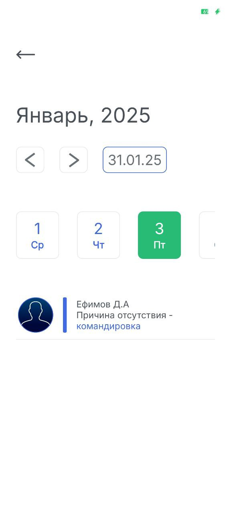

# **FlyV**

 


<p align="center">
  
</p>

## Описание

**FlyV** - система управления отпускными периодами сотрудников (СУОП). Основным предназначением разработанного мобильного программного обеспечения “FlyV” являлась реализация автоматизации следующих процессов:
- [X] Планирование и контроль отпуска в предприятия;
- [X] Оформления отгула;
- [X] Оформления больничного;
- [X] Просмотр отсутствующих на предприятии;
- [X] Просмотр наличия командировки.

UML UseCase диаграмма для программного решения **FlyV**
<p align="center">
  
</p>

Для разработки серверной части программного продукта, использовался следующий сервис - [Supbase](https://www.youtube.com/watch?v=_iXUVJ6HTHU&t=38s)
<p align="center">
  
</p>

Для полноценного ознакомления с данным программным решением, вы можете рассмотреть [документацию](https://github.com/frepsik/FlyV/blob/master/docs/Общий%20отчёт%20и%20презентация/Общий%20отчёт%20по%20FlyV.pdf), в которой подробно рассмотрены все различные аспекты разработанного мобильного программного продукта.

## Демонстрация продукта

**Основные окна** мобильного приложения FlyV:

<p align="center">
  
  
  
  
</p>


## Основные технологии в проекте

Для того, чтобы разработать данное программное обеспечение, были использован следующий перечень технологий:
- Android Studio:
  - ЯП: Kotlin.
- Supabase.

В данном приложении был создан, специализированный функционал, что предоставляет пользователю возможность, в результате оформления отпуска, добавить системное событие на мобильный телефон, о том, что у него будет отпуск, в выбранный период. Рассмотрим небольшую часть данного функционала:
```kotlin
 val intent = Intent(Intent.ACTION_INSERT).apply {
        type = "vnd.android.cursor.item/event"
        putExtra(CalendarContract.Events.TITLE, "Отпуск")  // Название события

        putExtra(CalendarContract.EXTRA_EVENT_BEGIN_TIME, firstDateEvent.timeInMillis)  // Время начала отпуска
        putExtra(CalendarContract.EXTRA_EVENT_END_TIME, lastDateEvent.timeInMillis)  // Время окончания отпуска

        putExtra(CalendarContract.Events.DESCRIPTION, "Описание события: отпуск")  // Описание
    }
```

## Уникальные особенности проекта

- [X] Интерактивный календарь - полностью разработанный вручную, что демонстрирует отсутствия сотрудников на рабочем месте;
- [X] Аналитика - отчёты об отсутствии, что позволят избежать различных проблем, касающихся отсутствий;
- [X] Уведомления - напоминание о предстоящих отпусках.


## Установка

Если вы хотите установить данный продукт, необходимо использовать следующую команду:
```
git clone https://github.com/frepsik/FlyV.git
```

Далее, для того, чтобы запустить само приложение для проведения дальнейшего тестирования и эксплуатации, необходимо открыть программное обеспечение **Android Studio** и выполнить следующий перечень шагов:
1. В открывшемся приложении необходимо открыть новый проект;
2. Далее произвести основную настройку проекта в Android Studio;
3. И в результате необходимо произвести запуск открытого проекта.

## Описание коммитов
| Название | Описание                                                        |
|----------|-----------------------------------------------------------------|
| build	   | Сборка проекта или изменения внешних зависимостей               |
| ci       | Настройка CI и работа со скриптами                              |
| sec      | Безопасность, уязвимости                                        |
| docs	   | Обновление документации                                         |
| project     | Изменение проекта мобильного приложения
| feat	   | Добавление нового функционала                                   |
| fix	   | Исправление ошибок                                              |
| perf	   | Изменения направленные на улучшение производительности          |
| refactor | Правки кода без исправления ошибок или добавления новых функций |
| revert   | Откат на предыдущие коммиты                                     |
| style	   | Правки по кодстайлу (табы, отступы, точки, запятые и т.д.)      |
| test	   | Добавление тестов                                               |

## Авторы

[](https://github.com/frepsik) [](https://github.com/frepsik)