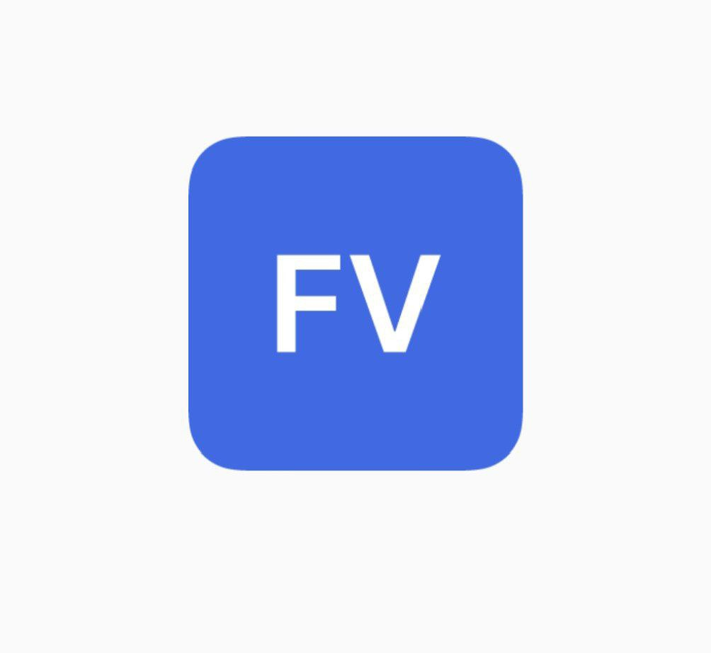

# **FlyV**

 

  

## Описание

**FlyV** - система управления отпускными периодами сотрудников (СУОП). Основным предназначением разработанного мобильного программного обеспечения “FlyV” являлась реализация автоматизации следующих процессов:
- [X] Планирование и контроль отпуска в предприятия
- [X] Оформления отгула
- [X] Оформления больничного
- [X] Просмотр отсутствующих на предприятии
- [X] Просмотр наличия командировки

UML UseCase диаграмма для программного решения **FlyV**

  

Для разработки серверной части программного продукта, использовался следующий сервис - **Supbase**

  

## Описание коммитов
| Название | Описание                                                        |
|----------|-----------------------------------------------------------------|
| build	   | Сборка проекта или изменения внешних зависимостей               |
| ci       | Настройка CI и работа со скриптами                              |
| sec      | Безопасность, уязвимости                                        |
| docs	   | Обновление документации                                         |
| project     | Изменение проекта мобильного приложения
| feat	   | Добавление нового функционала                                   |
| fix	   | Исправление ошибок                                              |
| perf	   | Изменения направленные на улучшение производительности          |
| refactor | Правки кода без исправления ошибок или добавления новых функций |
| revert   | Откат на предыдущие коммиты                                     |
| style	   | Правки по кодстайлу (табы, отступы, точки, запятые и т.д.)      |
| test	   | Добавление тестов                                               |

# Макет мобильного приложения
Ссылка на проект в Figma - https://www.figma.com/design/q6hpv1pT2QsWfcxqRGqnOh/FlyV?node-id=0-1&t=xfBbl48xgrvOwfDM-1
